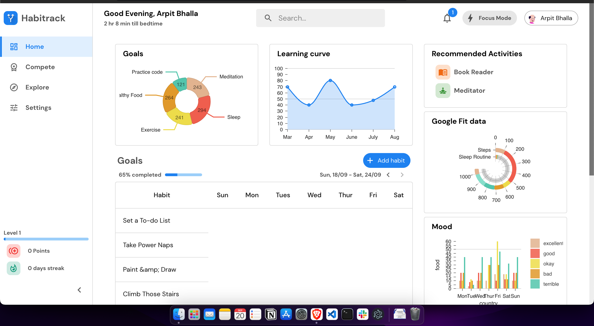
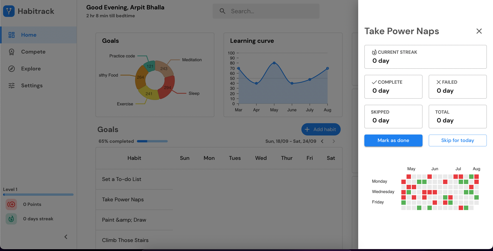
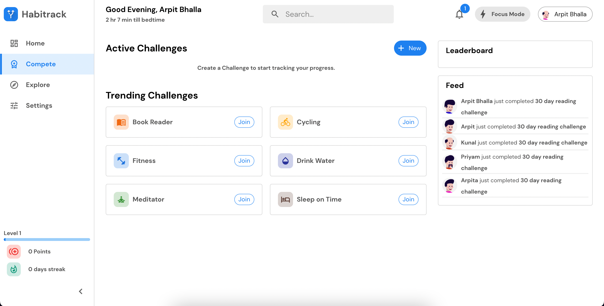
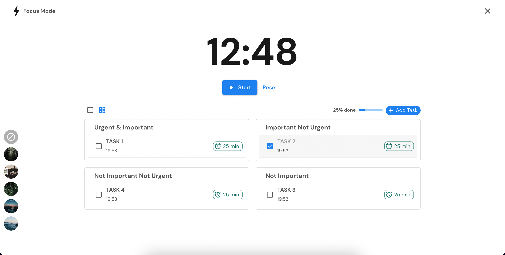
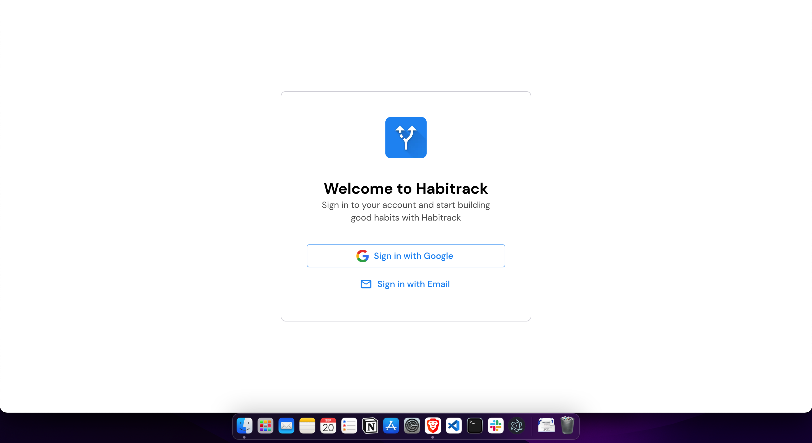

    

<h1 align=center>
    Habitrack
</h1>

An all in one app to track your habits and help build good habits and break bad ones

## SIH 2022 Grand Finale

<table>
<tr> 
<td> Team Name
<td> CodeChronicles
<tr>
<td> Tech Stack
<td> NextJS, Supabase
<tr>
<td> Problem Statement Code 
<td> KH1160
<tr>
<td> Verdict
<td> Winner 🏆
</table>

## Preview v2

<table>
<tr> 
<td colspan="2"> 
<tr>
<td> 
<td> 
<tr>
<td> 
<td> 
</table>

## Preview v1

